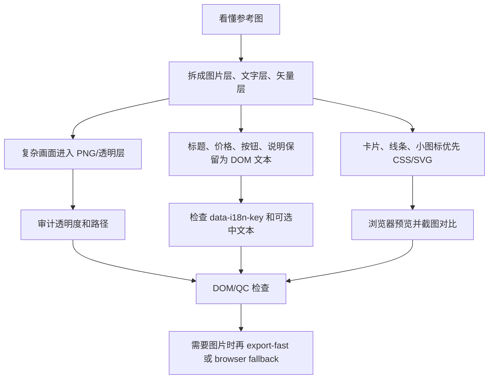
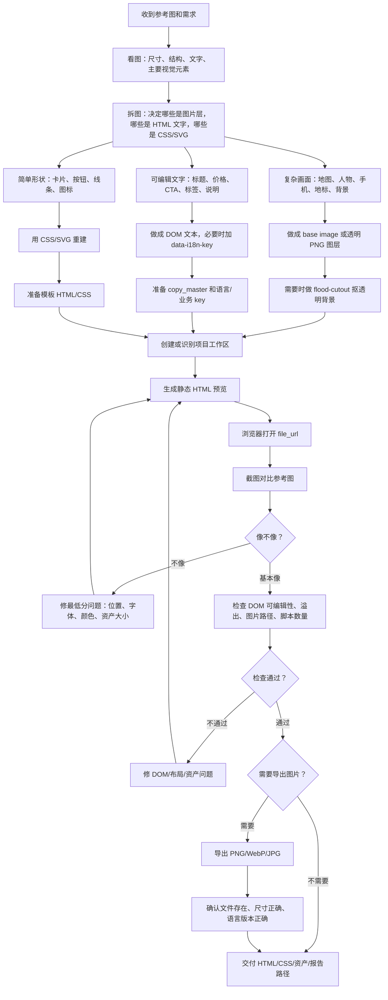
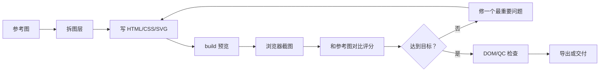

# text2html-image 工作流程 README

这份文档把 `text2html-image` skill 的工作方式整理成 Agent 和人类都能读懂的流程说明。它以“抄图、拆图、生成可编辑 HTML”为核心场景。

## 抄图、拆图、生成 HTML

这个 Skill 的目标不是把参考图压成一张死图，而是先生成可编辑的静态 HTML/CSS，再按需要导出图片。



关键守门：

- `prompt_only 不是资产`：外部图像模型 prompt 包只说明请求已准备好，不能直接放进 HTML。
- `当前预览微调`：用户指向已打开的 `file://` 预览时，先修当前 HTML/CSS/资产路径，不要全量重建。
- `outputs 路径检查`：交付副本里的图片路径要从交付 HTML 自己的位置解析。
- `复杂资产先路由`：人物、地图、云和天际线，应用程序图标这些难以用 SVG 或图形线条复刻的部分，请采用抠图或者反向生成提示词再生图的形式进行。
- 二维码和条码必须是从原图或源素材裁切的位图资产；小飞机、小功能图标优先 SVG/CSS 重绘。

## 这个 skill 到底做什么

`text2html-image` 不是把参考图直接截图或压成一张死图。它的目标是：

- 把参考图拆成可维护的图层。
- 把文字、价格、按钮、标签保留成可编辑 HTML 文本。
- 把圆角卡片、线条、按钮、标签等简单元素做成 CSS 或 SVG。
- 把复杂视觉元素做成图片层，例如地图、人物、地标、手机壳、插画背景。
- 最后生成静态 `index.html`、CSS 和资产文件，需要时再导出 PNG/WebP/JPG。

一句话：先做可编辑网页，再按需导出图片。

## 核心原则

### 1. 可编辑源码优先

文字、价格、CTA、说明、法律文案、国家名、SKU 标签等用户可能会改的内容，必须尽量保持为 DOM 文本。

不要把这些内容：

- 烘焙进 PNG/JPG。
- 转成 SVG path。
- 画到 canvas 上。
- 藏在不可编辑截图里。

### 2. 静态 HTML 优先

默认产物是静态 HTML/CSS/资产文件。

除非用户明确要求交互原型，否则不要加入：

- `<script>`。
- 前端状态机。
- 调试控制台。
- 浏览器自动化代码。
- 额外控制页面。

### 3. 先确认编辑面

修改前必须判断现在应该改哪里：

| 编辑面 | 什么时候用 | 注意事项 |
| --- | --- | --- |
| `template-source` | 修改可复用模板 | 改 `templates/<template_id>/`，之后可以 rebuild |
| `workspace-html` | 直接修已生成预览 | 改项目工作区里的 `html/index*.html` 或 `html/<group>/index*.html`，不要随便 rebuild |
| `deliverable-copy` | 修改已拷出的最终交付包 | 需要说明它是否已经和源项目脱钩 |

最常见事故是：用户只想微调当前 HTML，Agent 却 rebuild，把直接修改覆盖掉。

## 人类能理解的总流程



## Agent 执行流程

### Step 1：路由任务

先判断任务属于哪一类：

- 普通单图海报：走 fast path。
- 已有项目微调：先确认是 `workspace-html` 还是 `deliverable-copy`。
- 抄图复刻：进入截图对比循环。
- 多语言输出：确认 `html_group` 和所有 locale。
- 批量导出：先做 DOM/QC，再做 export。
- 复杂全流程：再看六阶段参考文档。

### Step 2：确认项目和路径

运行命令的位置是 skill 根目录：

```bash
/Users/tashima_meru/Develop/text2html-image/skills/text2html-image
```

生成项目默认放在：

```text
/Users/<user>/Documents/text2html-image-project/<project-id>/
```

所有项目输出都必须落在系统用户目录下的 `Documents/text2html-image-project`。不要使用 CloudStorage、OneDrive 或本地化 `文档` 路径。

不要把项目输出写到 skill repo 根目录里。

### Step 3：拆图并确定图层归属

拆图时先做这张表：

| 图层类型 | 放什么 | 交付形式 |
| --- | --- | --- |
| `reference image` | 参考图，只用于对照 | 不直接放进页面，除非用户同意 |
| `base image layer` | 地图、人物、地标、设备、复杂背景 | PNG/JPG/WebP，复杂透明图用 flood-cutout |
| `editable text layer` | 标题、价格、CTA、说明、国家名、SKU | HTML DOM 文本 |
| `editable vector layer` | 简单卡片、边框、圆角、图标、线条 | CSS/SVG |
| `debug/report layer` | 截图、坐标报告、评分 JSON | 只做证据，不出现在页面 UI |

`app_icon`、`application_icon`、`complex_icon`、人物、地图、云、天际线、地标和地球等难以矢量复刻的元素，必须先进入资产路由报告，再选择抠图或反向生成提示词再生图。只有 `simple_icon` 这类单色简单图标才默认允许 SVG/CSS 重绘。

### Step 4：准备内容和模板

fast path 只读最少文件：

```text
data/copy_master.json
templates/<template_id>/master.html
templates/<template_id>/master.css
当前任务需要的图片或资产
```

复杂任务再补充读取 `workflow.config.json` 或 `references/`。

### Step 5：创建项目并生成 HTML

常用命令：

```bash
npm run project:init -- --project <project-id>
npm run build -- --project <project-id>
```

如果一个任务里有多个独立页面或母版，用：

```bash
npm run project:init -- --project <project-id> --subproject <subproject-id>
npm run build -- --project <project-id> --subproject <subproject-id>
```

build 后要记录：

- 本地 HTML 路径。
- build 输出的 `file_url`。
- build 输出的 Markdown 预览链接。
- `reports/preview-links.md`，里面保留可重新打开的 HTML 链接清单。
- 当前 `html_group`。

平文本报告必须包含本地 HTML 文件路径。只给 `file://` 链接或 Markdown 链接不够。

最终回复里也要显式给出：

- 可点击的 HTML Markdown 链接。
- 纯文本绝对路径，方便不能打开 `file://` 的客户端手动复制。
- `reports/preview-links.md` 路径。

### Step 6：浏览器预览和截图对比

抄图复刻时，必须用真实预览做判断：

1. 打开 build 输出的 `file_url`。
2. 保存当前截图。
3. 对照参考图看差异。
4. 优先修最明显、最低分的问题。
5. 重复直到视觉接近，或用户停止。

不要只凭代码猜测效果。

Codex Browser 的元素/画圈标注能力不是固定保证。使用前要先在当前会话探测；如果探测失败，就用普通截图、DOM 快照、坐标说明或单独的视觉标注报告替代，不要声称已经使用了内置标注。

### Step 7：检查可编辑合同

完成前至少确认：

- 关键文字是 DOM 文本。
- 文字可以被选中。
- 没有把必改文字烘焙进图片。
- 没有把必改文字转成 SVG path。
- 没有用 canvas 画文字。
- 多语言文本有稳定 `data-i18n-key`。
- 国家、地区、SKU 等重复标签有稳定业务 key。
- 页面没有不该出现的 `<script>`。
- 图片路径从当前 HTML 文件位置可以解析。
- 没有明显滚动条或文字溢出。

推荐文本写法：

```html
<span class="map-label" data-country-code="FR" data-i18n-key="country.fr">法國</span>
```

### Step 8：多语言同步

如果项目有多语言文件：

```text
index.html
index.zh-cn.html
index.en-us.html
index.ja-jp.html
```

同一个 `html_group` 里的变体要一起维护，除非用户明确只改某一个语言。

改 locale 名称时，要同步：

- `copy_master.lang`
- HTML 文件名
- export 文件名
- report
- deliverable 文件名
- 手工维护的 variant list

### Step 9：导出图片

注意：`batch-export` 通常只是报告导出计划，不代表真的生成 PNG。

如果需要真实图片，优先使用：

```bash
npm run render:profile -- --project <project-id> --group <html-group>
npm run export-fast -- --project <project-id> --group <html-group> --scale 2
```

导出后要确认：

- 文件真的存在。
- 尺寸正确。
- scale 正确。
- 每个语言版本都导出了。
- source HTML 路径能追溯。

如果浏览器截图 fallback，需要保持 CSS viewport 不变，只提高 `deviceScaleFactor`，不要改 CSS 尺寸来骗高分辨率。

## 抄图复刻专用循环



每轮评分建议记录：

```json
{
  "project_id": "travel-esim-banner",
  "round": 1,
  "overall_score": 90,
  "layout_score": 90,
  "typography_score": 90,
  "color_score": 90,
  "asset_score": 90,
  "issues": [
    {
      "severity": "medium",
      "area": "layout",
      "observed": "生成图的 hero 偏低",
      "expected": "hero 中心和参考图对齐",
      "fix_hint": "把 hero 图层上移 20px"
    }
  ]
}
```

## 位图和透明图处理

当复杂图层必须用 PNG 时，例如地图、人物、地标、手机壳：

1. 尽量使用同画布尺寸的透明 PNG 图层。
2. 不要把海报主标题、价格、CTA 放进 PNG。
3. PNG 外部不能有灰底、白边、渐变光晕。
4. 有背景残留时运行：

```bash
npm run flood-cutout -- --input <source.png>
```

必须保留并检查：

- `*-transparent.png`
- `*-mask-debug.png`
- `*-cutout-report.json`

如果 report 提示移除比例异常，必须检查 mask debug，不能直接交付。

## 停止条件

出现下面情况时，不要声称完成：

- 必填 copy/SKU/spec 缺失。
- 生成 HTML 里还有未解析模板 token。
- 页面有明显滚动条、文字溢出或缺失资产。
- 必须可编辑的文字只存在于图片、SVG path 或 canvas。
- 文本不可选中。
- 缺少必要 i18n key 或业务 key。
- 输出写到了 repo root 或错误项目目录。
- DOM editability report 失败。
- 用户要求导出图片，但只生成了 `reports/export-report.json`。
- 透明 PNG 仍有灰边、光晕、半透明脏边。
- QR code 被重画、模糊、滤镜处理或路径不可解析。
- 直接改了 `workspace-html` 后又意外 rebuild 覆盖改动。

## 常用命令

```bash
npm run project:init -- --project <project-id> [--subproject <subproject-id>]
npm run build -- --project <project-id> [--subproject <subproject-id>]
npm run quality-check -- --project <project-id> [--subproject <subproject-id>]
npm run audit:dom -- --project <project-id> [--subproject <subproject-id>] [--group <html-group>]
npm run render:profile -- --project <project-id> [--group <html-group>]
npm run export-fast -- --project <project-id> [--group <html-group>] [--scale 2]
npm run flood-cutout -- --input <source.png>
npm test
```

## 最终交付时要说清楚

交付报告至少包含：

- 项目路径。
- 预览 HTML 路径。
- `file_url`。
- canvas 尺寸。
- active `html_group`。
- 图片数量。
- script 数量。
- 可编辑文本数量。
- i18n metadata 数量。
- business key 数量。
- DOM/QC 报告路径。
- 截图路径。
- 导出图片路径和尺寸。
- 已知限制或遗漏。

## 最短记忆版

```text
看图 -> 拆层 -> 复杂画面做图片 -> 文案做 HTML -> 简单形状做 CSS/SVG
-> 生成静态 index.html -> 浏览器截图对比 -> 修正
-> 检查可编辑性和路径 -> 需要时导出 PNG -> 报告所有可追溯路径
```
