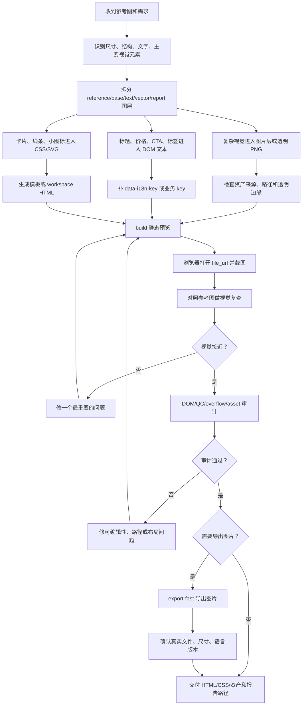
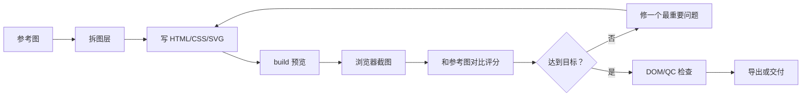

# text2html-image 工作流手册

`text2html-image` 是一个自包含的 Codex/Claude skill 包，用 HTML/CSS 生产可编辑的电商海报、广告图和多语言素材。它的核心目标不是把参考图压成一张死图，而是先做出可维护的静态页面，再在需要时导出 PNG/WebP/JPG。

仓库根目录只是 skill 仓库入口；真正的 npm 包在 `skills/text2html-image/`。生成出来的项目、截图、导出图和临时素材不要写进这个仓库，统一放到：

```text
~/Documents/text2html-image-project/<project-id>/
```

不要使用 CloudStorage、OneDrive 或本地化 `文档` 路径，也不要把运行输出写到仓库根目录。

## 目录定位

```text
.
├── README.md                         # 当前手册
├── SKILL.md                          # 仓库根入口，指向 canonical skill
├── AGENTS.md                         # 仓库协作规则
├── docs/                             # 设计说明和计划文档
└── skills/text2html-image/
    ├── SKILL.md                      # canonical skill instructions
    ├── package.json                  # 实际 npm 包
    ├── workflow.config.json
    ├── scripts/                      # init/build/QC/export/audit 等命令
    ├── data/                         # copy_master 等共享输入
    ├── config/
    ├── references/                   # 复杂编辑流程参考
    └── agents/
```

运行命令前先进入 skill 包目录：

```bash
cd skills/text2html-image
```

## 安装

把这个 skill 注册给本机 agent：

```bash
npm run install:all      # Claude Code + Codex
npm run install:claude   # 只安装到 Claude Code
npm run install:codex    # 只安装到 Codex
```

安装命令只负责注册 skill 包；项目生成、截图和导出仍然必须在 `~/Documents/text2html-image-project/<project-id>/` 下完成。

## 快速开始

```bash
cd skills/text2html-image

npm run project:init -- --project <project-id>
npm run build -- --project <project-id>
npm run quality-check -- --project <project-id>
npm run audit:dom -- --project <project-id> --group <html-group>
npm run render:profile -- --project <project-id> --group <html-group>
npm run export-fast -- --project <project-id> --group <html-group> --scale 2
```

如果使用项目级 copy 数据，构建时显式传入：

```bash
npm run build -- --project <project-id> --copy-data <copy-data.json>
```

如果一个项目里有多个独立页面或母版：

```bash
npm run project:init -- --project <project-id> --subproject <subproject-id>
npm run build -- --project <project-id> --subproject <subproject-id> --copy-data <copy-data.json>
```

项目 ID 使用短小稳定的 lowercase kebab-case，例如 `travel-esim-banner`。

## 核心原则

### 0. 抄图、拆图、生成 HTML

核心工作流是：看懂参考图，拆成图片层、文字层和矢量层，生成可编辑静态 HTML，再按需要导出图片。

关键守门：

- `prompt_only 不是资产`：外部图像模型 prompt 包只说明请求已准备好，不能直接放进 HTML。
- `当前预览微调`：用户指向已打开的 `file://` 预览时，先修当前 HTML/CSS/资产路径，不要全量重建。
- `outputs 路径检查`：交付副本里的图片路径要从交付 HTML 自己的位置解析。
- `复杂资产先路由`：人物、地图、云和天际线，应用程序图标这些难以用 SVG 或图形线条复刻的部分，先进入资产路由报告，再选择抠图、源素材裁切或反向生成。
- 使用 ImageGen / Codex image generation 生成复杂透明素材时，要求带 alpha 透明通道的 PNG；不要绿幕、绿色背景、chroma key 背景、白底、灰底、彩色底或 matte 背景素材。

### 1. 可编辑源码优先

用户可能修改、翻译或复用的内容必须尽量保持为 DOM 文本：

- 标题、副标题、价格、CTA。
- 法律文案、说明、角标、卖点。
- 国家名、地区名、SKU、规格表、标签。

不要把这些内容：

- 烘焙进 PNG/JPG。
- 转成 SVG path。
- 画到 canvas。
- 藏在不可编辑截图里。

推荐为可本地化或可追踪的文本加稳定 metadata：

```html
<span class="map-label" data-country-code="FR" data-i18n-key="country.fr">法國</span>
```

### 2. 静态 HTML 优先

默认产物是静态 `index.html`、CSS 和资产文件。除非用户明确要求交互原型，不要加入：

- `<script>`。
- 前端状态机。
- 调试控制台。
- 浏览器自动化代码。
- 额外控制页面。

### 3. 复杂视觉走资产层

复杂画面优先作为 base image layer 或透明 PNG 图层处理，例如：

- 人物、地标、地图、地球。
- 手机、设备、产品实拍。
- 云、天际线、复杂插画背景。
- 应用图标、复杂品牌 icon。

简单卡片、线条、边框、按钮、单色小图标优先用 CSS/SVG 重建。

### 4. 先确认编辑面

修改现有项目之前，先判断应该改哪里：

| 编辑面 | 什么时候用 | 规则 |
| --- | --- | --- |
| `template-source` | 修改可复用模板 | 改 `templates/<template_id>/`，之后 rebuild |
| `workspace-html` | 微调已生成预览 | 改项目工作区 `html/index*.html` 或 `html/<group>/index*.html`，不要随手 rebuild |
| `deliverable-copy` | 修改已拷出的最终交付包 | 说明它是否已经和源项目脱钩 |

最常见事故是用户只想修当前预览，agent 却 rebuild 覆盖了直接修改。

## 图层拆分

做图前先决定每一层属于谁：

| 图层类型 | 放什么 | 交付形式 |
| --- | --- | --- |
| `reference image` | 参考图，只用于对照 | 不直接放进页面，除非用户同意 |
| `base image layer` | 地图、人物、地标、设备、复杂背景 | PNG/JPG/WebP；需要透明时用 cutout |
| `editable text layer` | 标题、价格、CTA、说明、国家名、SKU | HTML DOM 文本 |
| `editable vector layer` | 卡片、边框、圆角、图标、线条 | CSS/SVG |
| `debug/report layer` | 截图、坐标报告、评分 JSON | 只作证据，不出现在页面 UI |

资产路由可用：

```bash
npm run route:assets -- --project <project-id>
```

报告中要区分 `simple_icon`、`complex_icon`、`app_icon`、`prompt_only`、`bitmap_truth` 等类型。`prompt_only` 只说明外部生成请求已准备好，不能当作可渲染资产放进 HTML。

二维码和条码必须来自原图或源素材裁切的位图资产，不能重画、滤镜处理或生成成看似相似的假码。

## 标准工作流



## 常用命令

所有命令都从 `skills/text2html-image/` 运行。

### 项目和构建

```bash
npm run project:init -- --project <project-id>
npm run project:init -- --project <project-id> --subproject <subproject-id>
npm run build -- --project <project-id>
npm run build -- --project <project-id> --copy-data <copy-data.json>
npm run template:check
npm run copy-schema
```

### 质量检查

```bash
npm run quality-check -- --project <project-id>
npm run audit:dom -- --project <project-id> --group <html-group>
npm run audit:overflow -- --project <project-id> --group <html-group>
npm run audit:visual-compare -- --project <project-id>
npm run review:score -- --project <project-id>
```

### 资产和来源审计

```bash
npm run route:assets -- --project <project-id>
npm run audit:imagegen -- --project <project-id>
npm run audit:routes -- --project <project-id>
npm run audit:source-truth -- --project <project-id>
npm run audit:bitmap-layers -- --project <project-id>
npm run audit:review-gates -- --project <project-id>
npm run audit:asset-readiness -- --project <project-id>
npm run audit:source-truth-acquisition -- --project <project-id>
```

### 视觉拆解和复查

```bash
npm run visual:intake -- --project <project-id>
npm run cutout:decompose -- --project <project-id>
npm run visual:review -- --project <project-id>
```

### 导出

```bash
npm run render:profile -- --project <project-id> --group <html-group>
npm run export-fast -- --project <project-id> --group <html-group> --scale 2
npm run batch-export -- --project <project-id>
```

`batch-export` 可能只创建报告，不代表真实图片已经生成。用户要求交付图片时，必须确认 PNG/WebP/JPG 文件真实存在、尺寸正确、语言版本完整。

### 透明图清理

```bash
npm run flood-cutout -- --input <source.png>
```

必须保留并检查：

- `*-transparent.png`
- `*-mask-debug.png`
- `*-cutout-report.json`

如果 cutout report 提示移除比例异常，先检查 mask debug，再决定是否使用该透明层。

### 学习报告

在大批量 ImageGen-TDD 训练后，先生成学习索引和报告，再继续下一轮训练：

```bash
npm run learning:index -- --root ~/Documents/text2html-image-project
npm run learning:report -- --root ~/Documents/text2html-image-project
```

报告默认写到：

```text
~/Documents/text2html-image-project/imagegen-tdd-learning-lab/reports/
```

### 测试

```bash
npm test
```

修改 workflow 行为、审计规则、脚本或 skill 文档硬门槛时，优先通过 `scripts/test.js` 增加或更新测试。

## 工作区布局

生成项目默认位于：

```text
~/Documents/text2html-image-project/<project-id>/
```

单 HTML group 的推荐浅层布局：

```text
<project-id>/
├── source/
├── html/
│   ├── index.html
│   ├── index.<lang>.html
│   └── master.css
├── exports/
│   └── index.png
└── project-summary.json
```

多 HTML group 的布局：

```text
<project-id>/
├── source/
├── html/<html-group>/
├── exports/<delivery-id-or-group>/
└── project-summary.json
```

需要保留过程证据时，使用 `runs/latest/`：

```text
<project-id>/
└── runs/
    ├── latest/
    │   ├── working/
    │   ├── screenshots/
    │   ├── scores/
    │   └── reports/
    └── YYYY-MM-DD-rNN-<reason>/
```

不要把每一次微调都提升成命名 run。命名 run 只用于用户验收、最终交付、可复用失败分析或关键前后对比。

## 预览和报告

每一轮让用户检查预览前，都要给出：

- 可点击 HTML Markdown 链接。
- 纯文本绝对路径。
- `reports/preview-links.md` 路径。
- 当前建议预览的 HTML 或 locale。

平文本报告必须包含本地 HTML 文件路径。只给 `file://` 或 Markdown 链接不够。

build 后记录：

- HTML 文件路径。
- build 输出的 `file_url`。
- Markdown 预览链接。
- 当前 `html_group`。
- `reports/preview-links.md`。

## 抄图复刻循环

抄图复刻时必须用真实浏览器预览判断，不要只凭代码猜效果。



建议每轮评分写入 JSON 或 Markdown，例如：

```json
{
  "project_id": "copy-image-poster",
  "round": 1,
  "overall_score": 90,
  "layout_score": 90,
  "typography_score": 90,
  "color_score": 90,
  "asset_score": 90,
  "issues": [
    {
      "severity": "medium",
      "area": "layout",
      "observed": "生成图的 hero 偏低",
      "expected": "hero 中心和参考图对齐",
      "fix_hint": "把 hero 图层上移 20px"
    }
  ]
}
```

如果参考图复刻进入验收阶段，保留硬证据：

- `reports/reference-vs-render-review.json`
- `reports/reference-vs-render-review.md`

视觉相似度不能覆盖 DOM 可编辑性、资产路由、source-truth、缺失素材或导出失败。

## 多语言维护

同一个 `html_group` 里的语言变体要一起维护，除非用户明确只改某一个 locale。

常见文件：

```text
index.html
index.zh-cn.html
index.en-us.html
index.ja-jp.html
```

改 locale 名称时，同步检查：

- `copy_master.lang`
- HTML 文件名
- export 文件名
- report
- deliverable 文件名
- 手工维护的 variant list

## 导出图片

真实导出优先使用：

```bash
npm run render:profile -- --project <project-id> --group <html-group>
npm run export-fast -- --project <project-id> --group <html-group> --scale 2
```

导出后确认：

- 文件真实存在。
- 尺寸正确。
- scale 正确。
- 每个语言版本都已导出。
- source HTML 路径可追溯。

如果使用浏览器截图 fallback，保持 CSS viewport 不变，只提高 `deviceScaleFactor`，不要通过修改 CSS 尺寸假装高分辨率。

## 完成前检查

不要在以下情况声称完成：

- 必填 copy、SKU 或 spec 缺失。
- HTML 仍有未解析模板 token。
- 页面有明显滚动条、文字溢出或缺失资产。
- 必须可编辑的文字只存在于图片、SVG path 或 canvas。
- 文本不可选中。
- 缺少必要 `data-i18n-key` 或业务 key。
- 输出写到了 repo root 或错误目录。
- DOM editability、overflow、asset readiness 或 source-truth 审计失败。
- 用户要求导出图片，但只生成了 `reports/export-report.json`。
- 透明 PNG 仍有灰边、光晕、半透明脏边。
- QR code 或 barcode 被重画、模糊、滤镜处理或路径不可解析。
- 直接改了 `workspace-html` 后又 rebuild 覆盖改动。
- DOM 文本叠在仍含同样文字的 bitmap 上，造成 baked raster text conflict。

最终交付说明至少包含：

- 项目路径。
- 预览 HTML 路径。
- `file_url`。
- canvas 尺寸。
- active `html_group`。
- 图片数量。
- script 数量。
- 可编辑文本数量。
- i18n metadata 数量。
- business key 数量。
- DOM/QC 报告路径。
- 截图路径。
- 导出图片路径和尺寸。
- 已知限制或跳过的验证。

## 最短记忆版

```text
看图 -> 拆层 -> 复杂画面做图片 -> 文案做 HTML -> 简单形状做 CSS/SVG
-> 生成静态 index.html -> 浏览器截图对比 -> 修正
-> 检查可编辑性、路径、来源、溢出 -> 需要时导出 PNG
-> 报告所有可追溯路径和已知限制
```
